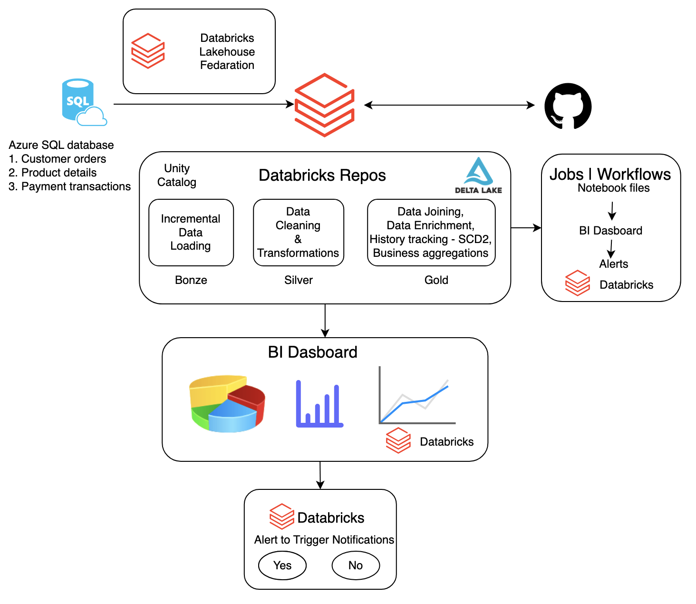

## Overview

The focus is on how data pipelines actually work —  processing only what changed, avoiding reprocessing, and keeping the system reliable and scalable.

---

## Case Study

We are working with an e-commerce system that generates data across:

- products  
- orders  
- payments  

This data is continuously evolving — new records are inserted and existing records are updated.

The goal is to design a pipeline that:

- processes only new or updated data  
- avoids duplicate ingestion  
- maintains state across runs  

---

## Ingestion (Lakehouse Federation)

Data is sourced from Azure SQL Database using Databricks Lakehouse Federation (Unity Catalog connection).

- Direct access to source tables via Unity Catalog  
- No traditional ETL connectors required  
- Data is incrementally loaded into Delta tables  

---

## Data Model

The pipeline is built on a relational model where:

- products, orders, and payments are interconnected  
- changes in one entity can impact downstream outputs  
- multiple tables are combined to produce analytics-ready data  

---

## Pipeline Design (Medallion Architecture)

### Bronze — Raw Layer

- Incremental ingestion using watermark logic  
- Control table to track last processed state  
- Raw Delta tables with ingestion metadata  

### Silver — Clean Layer

- Data cleaning, standardization, and deduplication  
- Data quality checks and quarantine handling  
- Incremental upserts using Delta MERGE  

### Gold — Business Layer

- Combines data across entities  
- Produces analytics-ready dataset  
- Maintains historical changes using SCD Type 2  

---

## Code Management (GitHub + Databricks Repos)

- Code is version-controlled using GitHub  
- Integrated with Databricks Repos  

Enables:

- version control  
- collaboration  
- clean separation of environments  

All pipeline notebooks are managed through this setup.

---

## Jobs & Workflows (Orchestration)

The pipeline is orchestrated using Databricks Jobs / Workflows, where:

- Notebook files (from Databricks Repos) are executed in sequence  
- Bronze → Silver → Gold layers are chained together  
- BI dashboards are refreshed after pipeline completion  
- Alerts are triggered as part of the workflow  

---

## Key Concepts Covered

- Incremental loading (no full reloads)  
- Watermark logic (timestamp + primary key)  
- Delta Lake MERGE (upsert)  
- Control tables for tracking state  
- Idempotent pipeline design  
- SCD Type 2  
